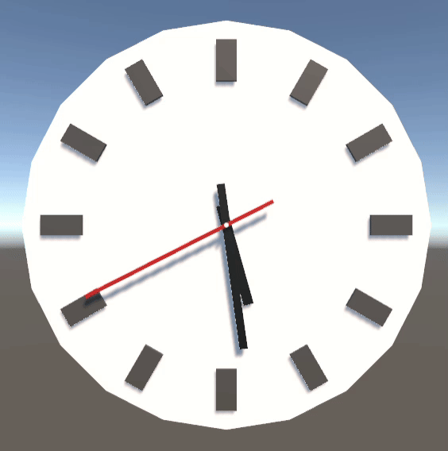

# Unity 3D Clock – Learning Project & Tutorial

This is a learning project based on Jasper Flick’s [Catlike Coding Unity tutorials](https://catlikecoding.com/unity/tutorials/).
This project is a part of my Unity learning journey, focused on understanding **basic GameObject manipulation** and **C# scripting**.  
It implements a working **3D analog clock** in Unity that shows the current system time using rotating clock hands.

---

## 📚 What I Learned

This project helped me understand and apply:

- ✅ Creating and positioning 3D GameObjects (clock face, hour/minute/second hands)
- ✅ Using `Transform.Rotate` and `Transform.localEulerAngles` for object rotation
- ✅ Reading and converting system time using `System.DateTime.Now`
- ✅ Writing clean, time-based updates in Unity’s `Update()` method
- ✅ Structuring Unity scripts and organizing them by responsibility
- ✅ Using Unity's component system and prefab instantiation
- ✅ Pushing a project to GitHub with `.gitignore` and `README.md`

---

## 🎓 Purpose

This is part of a personal learning portfolio.  
The goal is to **document my progress in graphics programming with Unity** — starting from beginner-friendly concepts like this clock, and eventually moving toward shaders, physics, and custom rendering.

---

## 🕹️ Project Overview

- 3D scene with a simple clock model
- Rotating hands synchronized to real time
- Hour, minute, and second hands rotate independently
- Written entirely in C# using MonoBehaviour

---

## 💼 Portfolio Use

This repository is part of my programming and Unity development portfolio.  
All code was written and structured by me based on basic Unity documentation and experimentation.

I’ll continue adding more projects to showcase my growth — each with its own GitHub repository and learning summary.

---

## 🔧 Tools Used

- Unity 2022+ (Built-in Render Pipeline)
- Visual Studio Code
- Git & GitHub for version control
